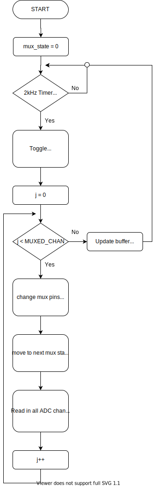

# PNG Datalogger

Mitchell Arndt --22 April 2021

# Project Description

Purdue Neurological Group (PNG) is involved in many different research projects, one of which involves measuring the effects of head trauma in athletics. More specifically, football helmet collisions. The goal of the project in regards to this repository is to design and implement high-speed data collection circuitry to measure the forces that take place during one of these football impacts (tackles). "Data collection circuitry" refers to the following:

- a microcontroller to read in analog inputs through an ADC
- variable resistance strain gauges to measure forces
- analog multiplexers to route 6 different signals into the microcontroller
- differential amplifier / wheatstone bridge to convert the sensor resistance changes into changes in voltage.
- SD card to record the data

<div style="page-break-after: always"></div>

# Testing SOP

## Development tools

- Download [Arduino IDE](https://www.arduino.cc/en/software)
- Download [Teensyduino](https://www.pjrc.com/teensy/td_download.html) add on to Arduino
- Download [Visual Studio Code](https://code.visualstudio.com/download) (VS code)
- Open VS code and click on the Extensions button on left nav bar (Ctrl+Shift+X)
- Search for PlatformIO IDE and install
- use [git bash](https://git-scm.com/downloads) or [wsl](https://docs.microsoft.com/en-us/windows/wsl/install-win10) to pull from this repository to your local machine
  - see [GitHub documentation](https://docs.github.com/en/free-pro-team@latest/github/creating-cloning-and-archiving-repositories/cloning-a-repository) for how to do this

### Optional for Post Processing Data

To run the post processing script to convert the binary data into .csv files you will need access to GNU Make from the command line. If you are on a Windows machine, you can download wsl [here](https://docs.microsoft.com/en-us/windows/wsl/) for bash command line ability.

- open the wsl command line and download <b>make</b> and <b>gcc</b>
- run the following commands:
  - sudo apt-get install make
  - sudo apt-get install gcc

## Updating Codebase/General Testing Set up

use this step before running any new tests to get the most up-to-date code from the repository

- use <b>git</b> to perform a pull on the repository
  - see [GitHub documentation](https://docs.github.com/en/free-pro-team@latest/github/using-git/getting-changes-from-a-remote-repository) for how to do this
  - run the following commands:
    - git reset --hard HEAD
      - this will clear any local changes you may have mistakenly made to the repository
    - git pull origin
      - this loads new code into your local machine
- Press the upload button in the bottom of VS code
  - this looks like a right arrow -> (see below)

<div align="center" style="text-align:center">
  
</div>

## Teensy Serial Interaction

make sure to update the codebase before you start a new day of testing!

- open a serial terminal connection
  - I recommend using [CoolTerm](https://freeware.the-meiers.org/) for its easy to use interface
- Once you initialize a connection with the Teensy you should see a serial welcome message from the Teensy
  - if you don't see this, check that you have the correct COM port selected for the board in the serial terminal settings
  - note that the serial settings are:
    - baud rate: 9600
    - data bits: 8
    - parity: none
    - stop bits: 1
- Once you have established a connection use the following commands for the board (<b>note that all commands are single characters, not a character and then a newline</b>):
  - 'c': create file
    - creates data output file and loads into ready state
  - 's': start data collection
    - after a file is created/loaded, this will begin the data collection
  - 'h': halt data collection
    - following a start command, this will halt data collection and close the file. The teensy then returns to an idle state.

### Example Operation:

`c` (after press wait to see what file is created. Teensy board should have a blinking LED to indicate it is ready to start data collection)

`s` (after press no serial will display but the LED will now be blinking very fast, will be perceived as a dim on)

`h` (after press a closing message will be displayed and indication of any errors in the data collection will be presented)

## Post Processing the Data

for this step, you will need access to command line c tools such as <b>make</b> and <b>gcc</b>

- copy the data from the SD card into the `/bin2csv` folder in this repository (local)
- run the following command: `make test args=F1`
  - Make sure to change F1 to be the name of the file that was created (don't include the .bin)
  - Make sure that you have navigated into the bin2cvs folder when you run `make` as this will not work from the top level folder

### Post Processing Options

At the top of `conversion.c` in the `/bin2csv` folder there are several post processing options to chose:

```c
#define CREATE_INT_FILE
#define CREATE_VOLTAGE_FILE

//Meta Data
#define TRACK_EXTREME_DT
#define REMOVE_ZERO_DATA
```

commenting/uncommenting these lines before running the `make test` command will result in different operations.

| Option              | Description                                                           |
| ------------------- | --------------------------------------------------------------------- |
| CREATE_INT_FILE     | generates integer data output file (0-4095)                           |
| CREATE_VOLTAGE_FILE | generates floating point data output file (0-3.3)                     |
| TRACK_EXTREME_DT    | terminal output will display min/max delta T for data                 |
| REMOVE_ZERO_DATA    | removes all data will time (t) value of zero (garbage data in buffer) |

### Additional Make Commands

`make clean` removes all .csv files and executables in `/bin2csv` directory

`make veryclean` removes all .csv , executables, <b>and .bin</b> files in `/bin2csv` directory

<div style="page-break-after: always"></div>

# Current State

updated 4/22/2021

Able to read in 30 channels at a frequency of 2000 Hz. The code is set up to be serial state machine with the following valid commands:

- Create File: 'c'
- Start Data Collection: 's'
- Halt Data Collection: 'h'

In the Run state, the code executes reads from the ADC and writes to the SD card at the fastest possible speed. Because of this the time can change between writes. To compensate for this, microsecond timestamps are written with every 60 channel conversion.

# Project History

updated 4/22/2021

## Spring 2019

- Joined the Project Team
- Initial hardware setup:
  - STM32F0Discovery Microcontroller
- Started with getting UART communication to work by using STMCubeMX software
  - This was a crucial first step as using serial to print out variables was essential debugging
  - This was before I had taken a course on microcontrollers and thus was learning all of my information from online resources
- Got the ADC to work with one channel using single polling mode
  - Learned that this method puts a strain on the CPU and thus will cause lower speeds.
- Got the ADC to work in direct memory access (DMA) mode
  - This method cuts out the need for the cpu to be involved with the ADC memory registers and thus speeds up the conversion
- Got a simple SD card read program to work
  - needed to probe the spi ports to make sure that the spi communication was working (it wasn’t initially and needed some tweaking)
  - sd card program would say that it had successfully mounted the drive when it didn’t (fixed this)
  - finally got a working sd card program that wrote to F1.txt and continuously appended the 10 adc channels from DMA
- Added a feature to auto generate a new (unique) file name for the data to be written (F1.txt, F2.txt, etc...)
- Added a hardware push button to trigger on/off the ADC collection
  - this was the first attempt to begin making a functional data collection program
  - struggled to get interrupts to work because of hardware button bouncing (didn’t know what this was at the time so I thought it was a software issue)
  - Button bouncing is when the signal from a user clicking a button with jitter pressing or releasing the button such that the microcontroller will falsely read multiple pressed when only one press has occurred
- Up to this point, I was retriggering the ADC after a DMA completion callback
  - this would continually be calling the ACD trigger and timing is unpredictable

## Fall 2020

- Plugged in the thing thinking I could pick right back up where I left off (wrong)
  - had to fix some issues with sd card not being recognized by the software
  - Changed GPIO ports to be an external pin
  - previously I was using the push button that was on the board which has no was of modifying the circuit as I explain below
  - added capacitors for hardware debouncing
    - I had learned what this was by this point which is the reason why I tried this approach
    - used way too small of caps which meant that they basically did nothing. Again, I thought the multiple presses detected by the microcontroller was a software issue…
- Set up code for selecting multiplexer lines between 10 channel readings
  - no hardware integration as we had yet to purchase any multiplexer devices to use so this was basically just toggling some GPIO pins while reading in the same data wired to the board
- Added UART interrupts
  - started with basic echoback interrupt which would echo the characters received back to the sender
  - used a user defined function send_uart() to write strings with a char buffer. This was later changed as the function kinda sucked
- Worked on speeding up the data write speed to sd card
  - tried reordering the code, changed timings, - I was able to get some faster results however the header of the file stopped being written, still not really sure why that was…
- Moved code into functional blocks in main to increase organization and readability of the code
  - previously it was all scattered about in main
- Created serial state machine for controlling the state of the device
  - IDLE - waiting for command
  - FILE_SEARCHING - supposed to be for user entering file to write and this would be where it was looking for input file (not ever implemented)
  - CREATING_FILE
    - mount sd card
    - looking for the next available file name (F1.txt, F2.txt,...)
    - creating the file with that name
      writing file header
  - LOADED - file name found, indicate ready by blinking blue led
  - VIEWING - supposed to be where you could see sample of file through uart but never implemented
  - RUNNING - data collection started and acd -> sd card is in process
  - CLOSING_FILE - close the file and unmount the sd card
- Had issues with state machine causing hardware faults

  - I believe this was due to improper buffering of data that was writing to places it shouldn’t but by fixing up the state machine I was able to fix this issue

- Set up timer 1 to be the trigger for the adc collection
  - set the frequency to 6000Hz
  - reason for this is that we want to get 6 adc collections at 1000Hz
  - each adc collection is for 10 channels
  - this leads to 60 adc channels at 1000Hz

### Here begins the fun issue of trying to increase SD card write speed!

- Initially getting 800 ish Hz
  - NOTE: I will continually put ish for the frequencies because I was using a very rudimentary approach to measure this frequency. I would start the adc collection, waiting a second (counting in my head) and then press stop. The number of collections would be my frequency
- changed some settings and was able to get 1k ish Hz
- added new flag variables to indicate to the main loop when the adc conversion was complete
  this dropped the data collection frequency by a significant amount

  - I think the reason for this was the main loop would continually write out data in the previous iteration regardless if the data was new. This meant that there would be repeats of data in the output file. Adding the adc flag ensured that there were no repeats
  - 30 channels with mux at 700 ish Hz
  - 60 channels with mux at 250 ish Hz

- Updated to the newer CUBEMX project structure

  - This decreased the amount of RAM usage on the mcu which is good because I was about maxing out the space with the old structure. There must be some good under the hood optimizations in the new project structure/compiler
  - was able to increase the write speed with the new structure to 60 channel mux with 350ish Hz (100 Hz increase from old structure)

- Tried switching up the FATFS drivers for getting better write speed
  - This basically was a huge waste of time
    - I tried 3-4 ish different driver software and they all performed basically the same.
  - At this point I was starting to learn about the timer subsystem in my microcontroller class
    - I realized that I didn’t have the timer set up correctly to be outputting 6000Hz
      - I think it was actually setup for something higher than this (7200ish) but I don’t remember and I didn’t document this
  - fixed the timer setup issue (once and for all? probably not...read on for more)
- Added a new data structure (adc_print_buffer) that would hold the adc values in memory and only write once the buffer was full
  - heard that you get faster/more efficient writes when you send larger amounts of data to the f_write() function
    - heard that you want to match the sd sector size (512 bytes) so that one write corresponds to writing one sector
      - This is all research that I have found on the internet and I am still actively trying to verify this
  - Had some initial issues (that were very annoying and time-consuming) where I was getting a hardware fault every time that I ran the data collection portion of the code
    - Eventually, I found that this was an issue with the way that I was writing to the print buffer (I was writing out of bounds basically) which means I was probably trying to write to read-only memory
- Added some new debugging variables

  - numPrints is an integer that counts the number of times that the print buffer is flushed in main
  - numConversions is an integer that counts the number of times that I get an adc callback
    - this should line up exactly with the trigger timer frequency (6000Hz)

- Changed the timer to 3000Hz and was getting 800 Hz from 30 mux channels

  - NOTE: here I didn’t use ish when describing the frequency! This is because of the debugging variables that I added in the previous point. Additionally, I added a time variable that held the system ticks. This allowed me to print out the start and stop time with ms accuracy. When using this as a divisor to the number of conversions and prints I could get accurate (ms) timing frequencies for these operations
  - Here things are a little blurry as I was changing up the timer frequency, data_buffer size, and number of muxed channels trying to optimize the write speed and I didn’t document as much as I should have
    - Basically, the best write speed from all of these many combinations that I found was about 800 Hz

- Here I tried switching gears a little bit

  - I tried to transfer my program for the stm32f0 to the stm32f4 that I was able to snag from my club
    - this didn’t work…
  - I went back to basics and tried to get UART working
    - had an issue where the huart1 didn’t work but the huart2 did. No idea why this was but spent a bunch of time trying to debug the huart1, when I switch it worked first time with no issues...figures
  - Got stuck trying to get the sd card example to work
    - getting a f_mount error = 3
      - tried probing the spi and was getting strange results.
        I think that the usb oscilloscope that I was using just didn’t have a large enough sample frequency for the high speed spi clock
      - I tried increasing the spi prescaler (lowering the frequency) however I was still getting junk data on the spi
      - tried switching from spi1 to spi2, spi3, spi4, however, they all didn’t work
        - spi4 really didn’t work where I was getting no data on the spi probe. Just flat lines… not sure why

- Switched gears and tried to get the stm32f4 board to work with sdio drivers and freeRTOS.
  - switched up the wiring
    - spent a ton of time going through datasheets on how to configure the board for sdio
      - found that sdio 1 bit is basically the same as with spi
      - this would open the door to 4 bit transfers through which would 4x the write speed
  - got the same fatfs error 3 which by the documentation means:
    - FR_NOT_READY
      - The lower layer, disk_initialize function, reported that the storage device could not be got ready to work. One of the following possibilities is suspected.
        - No medium in the drive.
        - Wrong lower layer implementation.
        - Wrong hardware configuration.
        - The storage device has broken.

| sd card pinout    | DAT0 | DAT1 | DAT2 | DAT3 | CLK  | VDD | VSS | CMD |
| ----------------- | ---- | ---- | ---- | ---- | ---- | --- | --- | --- |
| STM32F411         | PC8  | PC9  | PA9  | PB15 | PC11 | 3v3 | GND | PA6 |
| SD breakout board | DO   | x    | x    | CS   | CLK  | 3v  | GND | DI  |

- attempted to set up stm32f4 mcu with 4 channel sdio sd write example

  - continually received a fatfs 3 error
    - this means that the drive was not recognized
  - realized that I didn’t have the proper breakout board for this protocol
    - the one that I am using doesn't connect the data 1 and data 2 pins
      - its meant more for the spi communication which is similar to sdio 1 bit

- switched over to the lower speed but more basic 1 channel sdio version of the write
  - thought was that I could get a working 1 channel, get a new breakout board for all the needed pins and boom bang we would have a 4x increase in our write speed
  - this didn’t work, the card was still not being recognized with the fatfs 3 error
    - not sure why this happened, what I tried
      - changing the physical output pins
      - using the io register debugger feature to see if the pins had the proper setup
        - checked the mode registers, RCC clock, NVIC, ...

### Switched to using the Teensy 4.1 development board

- Created an initial program loop that would do the following:
  - Read all input channels
  - Write out the data to the SD card
  - repeat until receiving a halt 'h' signal from serial
- This initial program proved promising and was achieving an average write speed of around 2kHz. This excitement was short-lived as it was discovered that the writes were not happening on an even basis. The writes would occur in bursts of 100ish samples at a time at 200Hz. This meant that while the average write speed looked like 2kHz, the actual resolution was 200Hz, much lower than what was needed.
- The next step was to ensure that the writes were as evenly spaced as possible. The solution for this was to introduce a delay inside of the program loop so that the loop ran at a frequency of about 2000 Hz.
  - This fixed the issue of burst reading, however, it did nothing to address one key issue of this project: the write speed bottleneck. SD write times are not constant and every so often they need to change which sector they are writing to. This will cause the requested write to take an order of magnitude more time than a normal write.
- Around this time, I had started learning about Interrupt Service Routines (ISR) which are software events triggered by hardware timers. This seemed to fit our need directly as we could have a timer set for 2kHz to trigger a read for consistent data readings
  - the initial ISR design was a simple transfer of the code body of the program loop into the callback function for the ISR.
  - this meant that reads were consistent at 2kHz, but again did nothing to address the SD write bottleneck.

## Spring 2021

### The Home Stretch...

- Frustrated from the ISR design proving to be a waste of time, I switched tracks to investigate a scheduling approach.
  - Processor scheduling is a staple of modern computing. The basic of this technique is to allow multiple processes to be split into "time slices" that can then be interleaved to create the illusion of concurrency.
    - For this project we have two processes: reading in analog measurements and writing out to the SD card
  - I decided to use Real Time Operating System (RTOS) for this project as it is one of the most common microcontroller scheduling softwares (or operating systems). Additionally, I was able to find a port of RTOS for the Teensy which meant that I wouldn't have to struggle through porting over my own low-level implementation.
- After trudging through many example programs and seeing very little improvement in the performance of the data collection (in some cases saw performance decreased), I made the key realization as to the actual bottleneck of the project: the SD write speed. I found that no amount of scheduling or use of ISRs would fix this issue. The problem was in write speed consistency.
- I now had a better grasp on the problem. The system would have occasional hiccups (caused by changes to the current SD write sector) that would cause a single write to take much longer than the normal write. A somewhat obvious conclusion to solving this issue was buffering the data. A buffer is designed to absorb shock to a system. In our case, this shock was the infrequency SD sector change.
- My first successful (partially) effort with buffering came from a tri-buffer approach. There were two somewhat large buffers that would continually switch between acting as a read and write buffer. This way, one buffer could be in the process of being flushed to the SD card while the other buffer was reading in new information. There was one extra buffer that was the overflow buffer. The buffer would come into play on an especially long write from the SD card.
  - In retrospect, this system was bound to fail as it essentially didn't do much to buffer at all. There was one "overflow" buffer that was responsible for ALL the buffering. Flipping the two read and write buffers only allowed for simultaneous read and writes and didn't do anything to actually absorb the shock of SD write delays.
- The final design was a complete rework of everything that came before. I took what I learned from my previous buffering approach and implemented a large circular buffer. This data structure allowed for continuous reads without the overhead of switching between and read and write buffer as before. Additionally, this provided a continuous stream of data for the SD write functionality.
  - At the time of writing this, the longest recorded test with this new system lasted 24 minutes of continuous 2kHz by 30 channels data collection with not a single data point missed.

<div style="page-break-after: always"></div>

### Key Takeaways

#### Program Loops Stink

> For many of this project's iterations, the core structure of the code was an infinite program loop. This is the simplest construct and works well for basic projects. The main reason that this would not work for this project specifically is the variability of the execution time of a program loop structure. Due to the nature of modern computer architecture, the same block of looping code may take vastly different execution time due to branch mis-prediction, instruction - data caching, and IO latency. For an application where the consistency and reliability of the collected data is of utmost importance, one must look towards other embedded system design methods such as hardware-based timer interrupts or software-based time slice scheduling.

#### Throwing Cool Technology at a Problem won't solve it

> RTOS is an interesting method of solving microcontroller computing problems. The illusion that it provides of multi-threaded applications on a single core processor can open the door for many exciting new projects. The problem with the easy of access of this and other new open source software is that one can fall into the trap of improper tool use. In my case, I was trying to fit my circular problem into a square solution. RTOS allows for building complicated programs on modest hardware, but at the cost of some signification software overhead. Additionally, RTOS is a solution to programming two tasks that need to be performed simultaneously. For this project, I jumped to the conclusion that concurrent reads and writes were needed to solve the write time bottleneck issue. This turned out to be a false assumption. The issue was one of infrequent spikes in SD card write latency. Spending more time up font to fully understand a potential solution, including its drawbacks, not only will help to prevent wasted time, but it also improves one's understanding of the problem they are facing in the first place.

#### Buffers don't Solve Everything

> This takeaway is similar to the previous. Buffering is another tool that can be thrown around without much thought. When applied incorrectly, a buffer is useless. I ran into this issue with my tri-staged buffer technique. I spend many hours debugging and "perfecting" a buffer solution that was ill conceived from the start. Even after developing the final circular buffer solution that proved successful, it is still important to be cautious about implementing a buffer. A buffer will only ever work if it is absorbing shock. What it does not do is correct an imbalance between the frequency of inputs and outputs. An example of this would be if the average write speed was less than the analog read speed. In this scenario, no amount of buffering would be able to solve the issue. Eventually, the buffer space would run out and the data would be corrupted. A core understanding of the problem must be a requisite before applying any tool.

<div style="page-break-after: always"></div>

# Dataflow

<div align="center" style="text-align:center">
  
</div>

<div style="page-break-after: always"></div>

# Resources

- Used Teensyduino builtin ADC examples as a starter template

- FatFs

  - http://elm-chan.org/fsw/ff/00index_e.html

- TeensySdioDemo

  - https://github.com/greiman/SdFat/blob/master/examples/TeensySdioDemo/TeensySdioDemo.ino

- Datalogger Example

  - https://github.com/PaulStoffregen/SD/blob/master/examples/Datalogger/Datalogger.ino

- SD Non-Blocking Example

  - https://github.com/arduino-libraries/SD/blob/master/examples/NonBlockingWrite/NonBlockingWrite.ino

- TeensyThreads

  - https://github.com/ftrias/TeensyThreads

- FreeRTOS-Teensy

  - https://github.com/tsandmann/freertos-teensy
